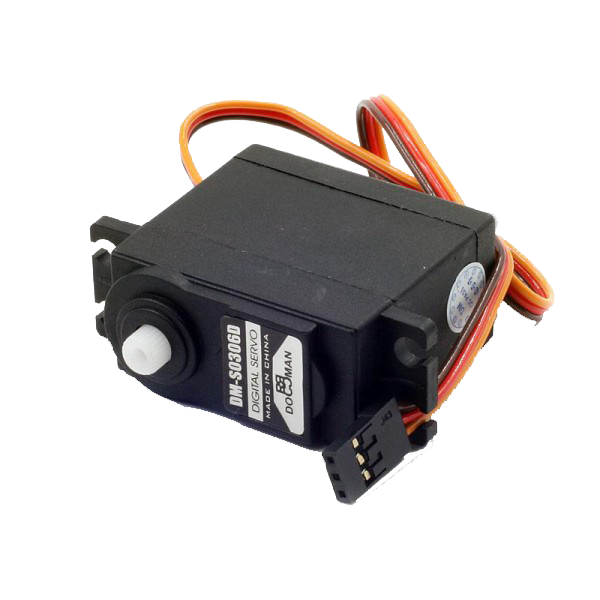
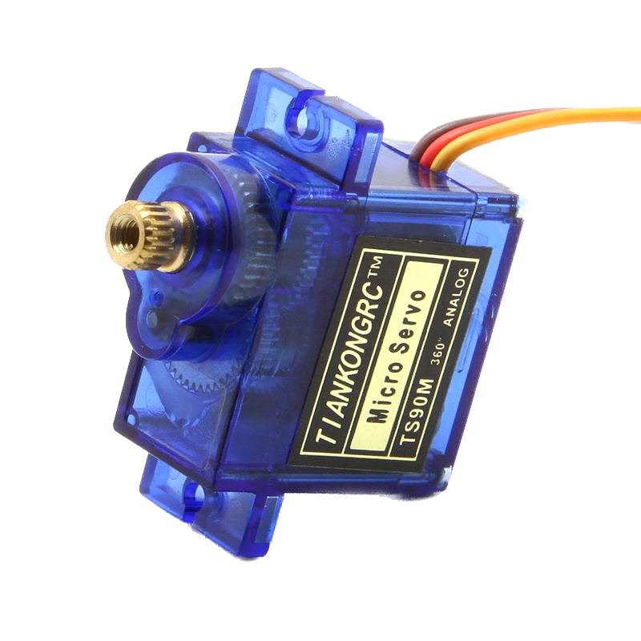

# Servo

In this example the microcontroller drives a hobby servo. Set `continuous` at the top of the
script to say which kind you have:

- **`False`** — the usual servo, which turns to an angle and holds it. The script steps to 0,
  90 and 180 degrees, sweeps smoothly across, then releases.
- **`True`** — a 360 degree servo, which turns continuously. The script runs it at several
  speeds in both directions, stops it, then releases.

<p float="left">
  
  
</p>

## Requires
This example needs the [Hobby servo](../../drivers/servo) driver installed on the board.
> Install it from the library panel in the Pulsar IoT IDE, or copy the driver's `.py`
> files into `/lib` on the microcontroller yourself.

## Connections

Three wires, and the colours are near enough standard: brown or black is ground, red is power,
and the pale one — orange, yellow or white — is the signal.

| Servo | ESP32 | Pico |
| --- | --- | --- |
| Signal (orange / yellow / white) | 17 | 16 |
| Power (red) | a separate 5V supply | a separate 5V supply |
| Ground (brown / black) | GND, shared with the board | GND, shared with the board |

**Do not power the servo from the board's 3.3V pin.** Even a small SG90 pulls several hundred
milliamps the moment it starts moving, and much more if something blocks it. The board browns
out and resets, which looks like a software fault and is not one. Use a separate 5V supply and
join its ground to the board's.

The signal wire is happy at 3.3V from an ESP32 or a Pico, even though the servo itself runs on
5V.

## How a servo is told what to do

Everything else driven by PWM cares about the duty cycle: what share of the time the pin is on.
A servo does not. It measures **how long each pulse lasts** and ignores the rest.

| Pulse | Positional servo | Continuous rotation servo |
| --- | --- | --- |
| about 1.0ms | one end of its travel | full speed one way |
| about 1.5ms | the middle | stopped |
| about 2.0ms | the other end | full speed the other way |

The driver does that arithmetic, which is why this example asks for degrees and speeds rather
than duty cycles. If you want to see it underneath, `servo.pulse_us` is the pulse being sent.

## Output

For a positional servo:

```
Angle: 0 degrees
Angle: 90 degrees
Angle: 180 degrees
Angle: 90 degrees
Angle: 0 degrees
Angle: 5 degrees
...
Released
```

For a continuous one:

```
Speed: 1.00  (full speed)
Speed: 0.35  (slowly)
Speed: 0.00  (stopped)
Speed: -0.35  (slowly back)
Speed: -1.00  (full speed back)
Released
```

## Tuning it

`min_us` and `max_us` are the pulse lengths at the ends of the travel, and every servo is a
little different.

- **Buzzing and straining at 0 or 180?** It is being pushed past its own stop. Bring `min_us`
  up and `max_us` down until the noise goes.
- **Never quite reaching either end?** Widen them. The 1000 to 2000 quoted in datasheets falls
  short on most servos; 500 to 2500 usually reaches the lot.
- **A continuous servo creeping when told to stop?** Its stop point is not exactly in the
  middle. Adjust `stop_us` by a few tens of microseconds until it sits still.

## Releasing

`servo.release()` stops the pulses altogether. A positional servo goes limp, stops buzzing and
stops drawing current; a continuous one coasts to a halt. That is different from telling a
continuous servo `speed = 0`, which keeps it actively holding itself against being turned.

## Plotter

Open the **Plotter** tab beside the REPL. The sweep draws a clean ramp of the angle, and the
continuous version draws the steps in speed. It is what the servo was *told*, not where it
actually is — a servo has no way to report that it was stopped by something.

## Tested

The servos below were used with the earlier version of this example, which drove the PWM
directly, on an ESP32 Devkit v1 and an ESP32S3 (FeatherS3):

- DM-S0306D
- TS90M

The rewritten script, which uses the driver, has not been run on hardware yet. If you try it,
say so here.
